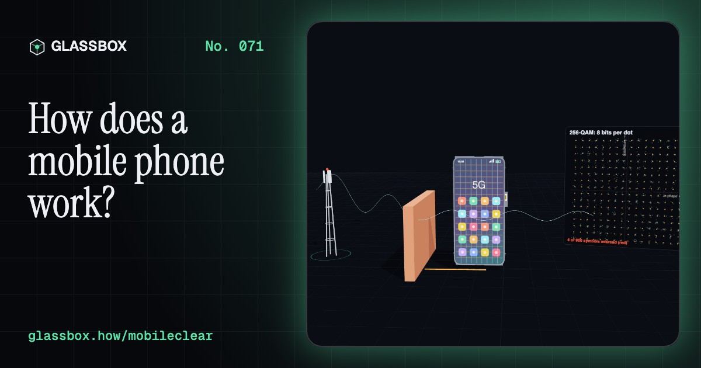
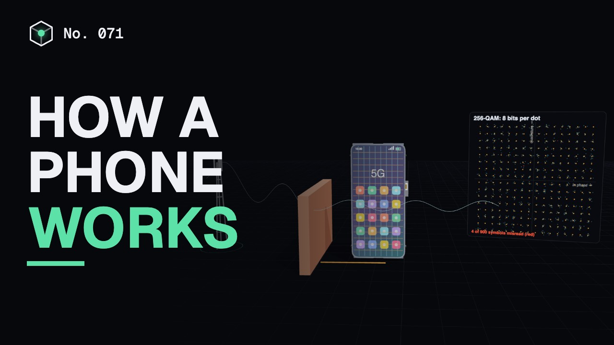
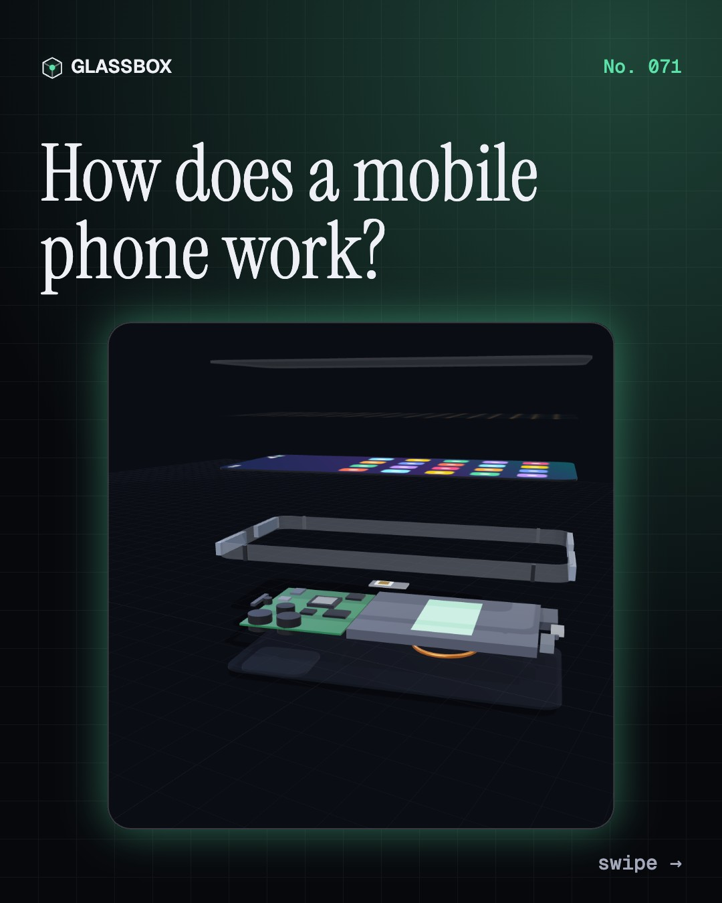
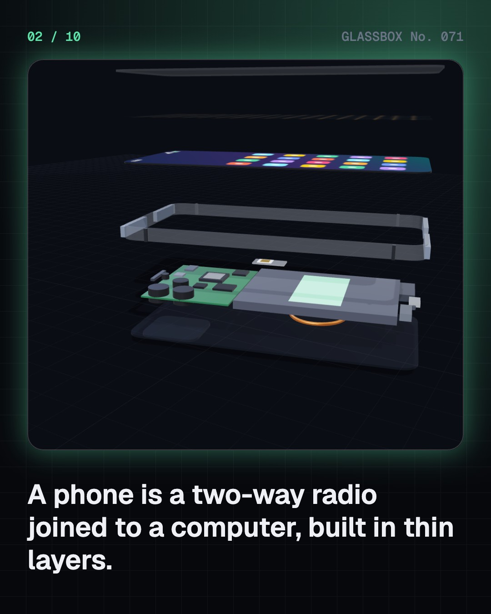
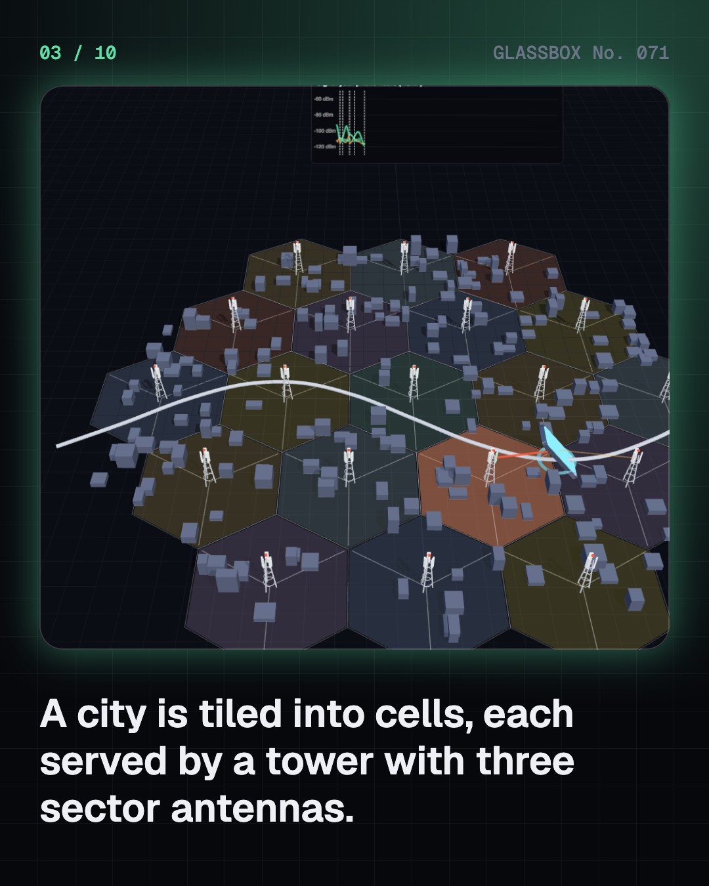
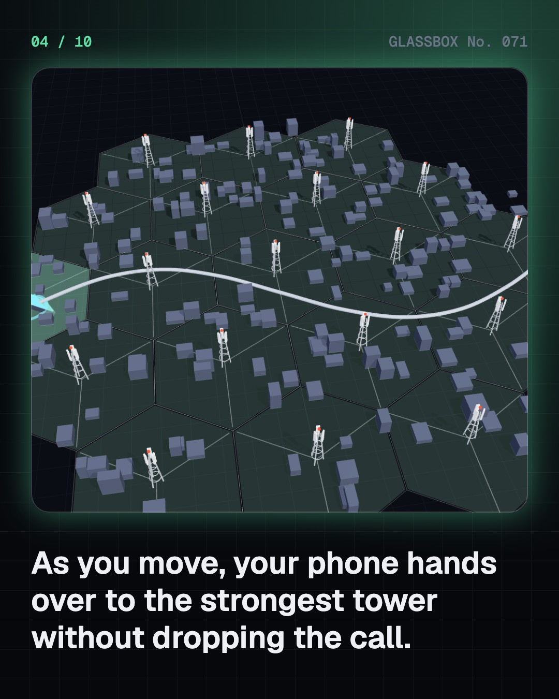

<!-- glassbox:start -->
<!-- Generated from glassbox.json by the Glassbox hub (npm run readme -- mobileclear). Edit glassbox.json, not this block. -->
<p align="center"><a href="https://glassbox.how/e/mobileclear/"></a></p>

<h1 align="center">MobileClear</h1>

<p align="center"><b>How does a mobile phone work?</b><br>Your phone is a two-way radio that shouts to a tower up to a few kilometres away, proves who you are with a secret key, and hands your call from cell to cell without a click. Pull one apart in 3D, drive through a city of towers, and watch bits blur in the noise.</p>

<p align="center"><a href="https://glassbox.how/mobileclear/"><b>▶ Play with it</b></a> &nbsp;·&nbsp; <a href="https://glassbox.how/e/mobileclear/">Read the 60-second explainer</a> &nbsp;·&nbsp; <a href="https://glassbox.how/mobileclear/glassbox/reel.mp4">Watch the 40-second video</a></p>

<p align="center">
  <a href="https://glassbox.how/e/mobileclear/"></a>
  <a href="https://glassbox.how/e/mobileclear/"></a>
  <a href="LICENSE"></a>
  <a href="LICENSE-CONTENT.md"></a>
  <a href="#privacy"></a>
</p>

## In 60 seconds

1. **A radio joined to a computer.** Under the glass, the touch layer and the OLED screen, a phone is mostly battery. Beside it, a mainboard carries the system on a chip, the modem that speaks 4G and 5G, and the RF front-end that drives several antennas hidden in pieces of the metal frame.
2. **A city cut into cells.** A phone sends at most about 0.2 W, so a city is covered by many towers, each with three sector antennas serving a patch called a cell. Signal fades as 1/d² in free space and faster among buildings. When a neighbouring cell is clearly stronger, the network hands your call over in milliseconds.
3. **Bits on a wave.** Phones use bands from 700 MHz (43 cm waves that reach far and pass walls) to 3.5 GHz (8.6 cm waves with more room for data), plus 26 GHz millimetre waves for 5G. Each symbol is a dot on a constellation: QPSK carries 2 bits, 256-QAM carries 8. When noise blurs the dots, the phone falls back to a simpler pattern.
4. **1G to 5G, and India's leap.** Analogue voice gave way to digital GSM and texts, then the mobile web, 4G video and 5G. India's first call was on 31 July 1995. After Jio launched in 2016, TRAI figures show a gigabyte of data falling from about ₹269 in 2014 to about ₹12 in 2018.
5. **A call in five steps.** Dial, then your SIM answers a random challenge with a secret key that never leaves it. The core network pages the other phone, it rings, and your voice flows as 20 ms packets, 50 a second each way. A text is 140 bytes: 160 letters, or 70 in Hindi.
6. **Battery, safety and e-waste.** A 5,000 mAh battery holds about 19 Wh. The screen, the chip and, in a weak signal, the radio drain it. Phone radio is non-ionising, far too weak per photon to damage DNA; its only proven effect is slight heating, capped in India at 1.6 W/kg over 1 g. Only about 22% of the world's e-waste is properly recycled.

## Words worth knowing

| Term | Meaning |
|---|---|
| **Cell** | The patch of ground served by one tower antenna; many cells tile a city like a honeycomb. |
| **Handover** | Moving a phone's connection to a stronger cell without dropping the call. |
| **Path loss** | How much weaker a radio signal gets between tower and phone, in decibels. |
| **Wavelength** | The length of one wave: λ = c / f, 43 cm at 700 MHz and 8.6 cm at 3.5 GHz. |
| **QAM** | A way of sending several bits per symbol by setting a wave's size and phase to one of many grid points. |
| **SIM** | A tiny smart card holding a secret key that proves to the network who you are. |
| **SMS** | A 140-byte text message carried on the network's control channel: 160 letters, or 70 in Unicode. |
| **SAR** | Specific absorption rate: radio power absorbed by the body, limited in India to 1.6 W/kg over 1 g of tissue. |
| **Non-ionising radiation** | Radiation whose photons are too weak to knock electrons off atoms, like radio and visible light. |

## A short history

**Eighty years from phones bolted into cars to a billion Indian connections and a supercomputer in every pocket.**

- **1947** · The idea of cells (Douglas H. Ring and W. Rae Young, Bell Labs, New Jersey, USA)
- **1973** · The first handheld mobile call (Martin Cooper, Motorola, New York City, USA)
- **1991** · The first GSM call (Harri Holkeri, Radiolinja, Helsinki, Finland)
- **1992** · "Merry Christmas": the first text (Neil Papworth, Newbury, UK)
- **1995** · India's first mobile call (Jyoti Basu and Sukh Ram, Kolkata and New Delhi, India)
- **2007** · The iPhone (Apple, USA)
- **2008** · Android arrives (Google, HTC and T-Mobile, USA)
- **2009** · 4G LTE switches on (TeliaSonera, Stockholm and Oslo)

The full story, with 27 moments, charts, people and 47 sources: [glassbox.how/e/mobileclear/history](https://glassbox.how/e/mobileclear/history/). The data lives in [`history.json`](history.json).

## Video and slides

Made with the Glassbox studio from this box's storyboard (`window.glassbox.director`). Free to reuse under CC BY 4.0.

<a href="https://glassbox.how/mobileclear/glassbox/video.mp4"></a>

<p><a href="glassbox/slide-1.jpg"></a> <a href="glassbox/slide-2.jpg"></a> <a href="glassbox/slide-3.jpg"></a> <a href="glassbox/slide-4.jpg"></a></p>

| File | What | Size |
|---|---|---|
| [`glassbox/reel.mp4`](https://glassbox.how/mobileclear/glassbox/reel.mp4) | Reel / Short, with captions and soundtrack | 1080×1920 |
| [`glassbox/video.mp4`](https://glassbox.how/mobileclear/glassbox/video.mp4) | YouTube video, with captions and soundtrack | 1920×1080 |
| `glassbox/slide-1…10.jpg` | Instagram carousel | 1080×1350 |
| `glassbox/thumb.jpg` | YouTube thumbnail | 1280×720 |
| `glassbox/cover.jpg` | Share card and repo social preview | 1200×630 |
| [`glassbox/history-reel.mp4`](https://glassbox.how/mobileclear/glassbox/history-reel.mp4) | “History in 10 moments” Reel / Short | 1080×1920 |
| `glassbox/history-slide-*.jpg` | History carousel | 1080×1350 |
| `glassbox/post.json` | Post copy and schedule used by the publish kit | |

## Privacy

This box has no accounts and no ads, and it ships its own fonts and libraries. When you run it yourself it sends nothing anywhere. On glassbox.how, the site's `/bar.js` also loads Glassbox's analytics: **Google Analytics** to count visits (it asks first in the EU, UK and Switzerland, and stays off when your browser sends Global Privacy Control or Do Not Track) and **ClickTrust** to detect bots.

It remembers a few things **in your own browser only**, and never sends them anywhere:

| Browser storage key | What it holds |
|---|---|
| `mobileclear.v1` | Which chapters you have opened, your best quiz scores, and sound on or off. |

Exactly what each one sees is at [glassbox.how/privacy](https://glassbox.how/privacy/).

## Licences

- **Code:** [MIT](LICENSE). Use it, change it, ship it.
- **Explanations, text, images and videos** (`glassbox.json`, `glassbox/`): [CC BY 4.0](LICENSE-CONTENT.md). Credit “Glassbox, glassbox.how/e/mobileclear”.
- **Third-party parts** keep their own licences: [three.js](https://threejs.org) (MIT), [Geist, Instrument Serif](https://openfontlicense.org) (SIL OFL 1.1).
- The Glassbox name and logo aren't covered by either licence. See the [terms](https://glassbox.how/terms/).

Found a mistake? [Open an issue](https://github.com/bdeeps/mobileclear/issues). Corrections happen in public.
<!-- glassbox:end -->

## Run it

It's plain HTML, CSS and JavaScript. No build step and no dependencies. Run locally, it contacts no other website.

```bash
python3 -m http.server 8000
```

Three.js and the fonts ship in `vendor/` and `fonts/`, so it also works offline.

Then open http://localhost:8000.

## How it's built

| File | What |
|---|---|
| `index.html`, `css/app.css` | The page and its styles |
| `js/app.js`, `js/stage.js`, `js/ui.js`, `js/kit.js` | The shared Glassbox 3D engine: chapters, 3D stage, controls, quiz, video director |
| `js/mobile.js` | MobileClear's shared models and physics: the layered phone and tower models, path loss (free space, Okumura–Hata, COST-231), sector antennas and handover, QAM constellations and error rates, SMS and voice-delay budgets, and the power model |
| `js/chapters/*.js` | One file per chapter: the 3D model, controls, text, key terms, quiz and video scenes |
| `glassbox.json` | Title, question, explainer beats, key terms, browser storage and credits shown on glassbox.how |
| `reel` in each chapter | The storyboard the Glassbox studio records into short videos |
| `glassbox/` | The published video, slides, thumbnail and post copy |
| `fonts/`, `vendor/three/` | Self-hosted Geist and Instrument Serif (SIL OFL 1.1) and three.js (MIT) |
